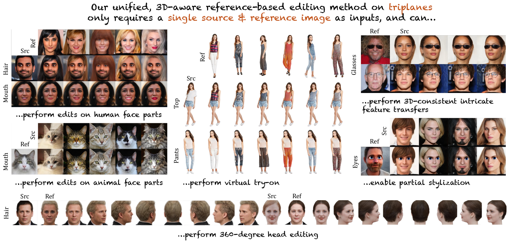

# Reference-Based 3D-Aware Image Editing with Triplane

[Bahri Batuhan Bilecen](https://three-bee.github.io), Yigit Yalin, [Ning Yu](https://ningyu1991.github.io/), and [Aysegul Dundar](http://www.cs.bilkent.edu.tr/~adundar/)

**Abstract:** 
Generative Adversarial Networks (GANs) have emerged as powerful tools for high-quality image generation and real image editing by manipulating their interpretable latent spaces. Recent advancements in GANs include the development of 3D-aware models such as EG3D, characterized by efficient triplane-based architectures enabling the reconstruction of 3D geometry from single images. 

However, scant attention has been devoted to providing an integrated framework for high-quality reference-based 3D-aware image editing within this domain. This study addresses this gap by exploring and demonstrating the effectiveness of EG3D's triplane space for achieving advanced reference-based edits, presenting a unique perspective on 3D-aware image editing through our novel pipeline.

Our approach integrates the encoding of triplane features, spatial disentanglement and automatic localization of features in the triplane domain, and fusion learning for desired image editing. Moreover, our framework demonstrates versatility across domains, extending its effectiveness to animal face edits and partial stylization of cartoon portraits. The method shows significant improvements over both qualitatively and quantitatively, relevant 3D-aware latent editing and 2D reference-based editing methods.

## Code
Will be published soon!
